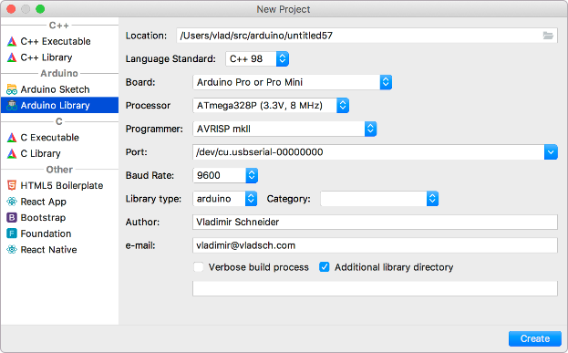

#  CLion Arduino Plugin

This is a JetBrains CLion plugin that integrates
[Arduino CMake](https://github.com/francoiscampbell/arduino-cmake) into the IDE.

[JetBrains Plugin Page](https://plugins.jetbrains.com/plugin/11298-clion-arduino-plugin)

The current features are to create an Arduino CMake project in one click, and to create new
sketch files.

For those asking how to upload, you need to specify the serial port in the CMakeLists.txt file.
For example:

    set(${CMAKE_PROJECT_NAME}_BOARD uno)
    set(${CMAKE_PROJECT_NAME}_PORT /dev/ttys0)

This will create the 'upload' configuration in your Run Configurations and you can click the Run
button or use the keyboard shortcut to upload.

Future features are to add menu option to easily change the board type, port number, import
existing Arduino projects, etc.

## Update on status:

Forked to fix CLion 2018 issues and decided that I will add a few creature comforts, soon.

* [x] Convert to project wizard in new project as Arduino Sketch Project, instead of file menu
      item.
* [x] Add Configuration options:
  * [x] Board selection
  * [x] CPU selection
  * [ ] User selectable boards.txt and programmers.txt location
* [ ] Load Libraries from URLs
* [ ] Add Import Arduino IDE config and sketches

## Release notes

[CLionArduinoPlugin Version Notes](VERSION.md)

