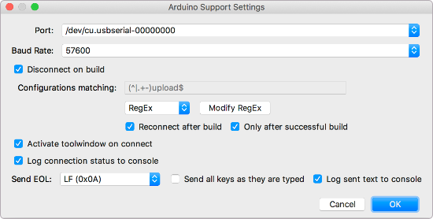
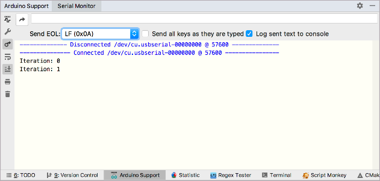
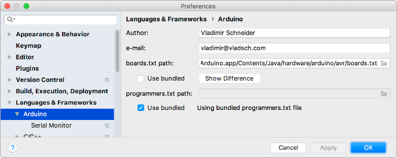

#  Arduino Support

A JetBrains CLion plugin to integrate
[Arduino CMake](https://github.com/francoiscampbell/arduino-cmake) into the IDE.

[JetBrains Plugin Page](https://plugins.jetbrains.com/plugin/11301-arduino-support)

Create an Arduino CMake project in one click with new project wizard types and view
communications with the integrated serial monitor tool window.

* `Arduino Sketch` and `Arduino Library` project types to new project wizard, with Options to
  select board type, cpu, programmer and port

* `Arduino Sketch` new file action

* Serial port monitor tool window with options to disconnect on build start and reconnect on
  build complete.

  :warning: Build events are only available in CLion 2018.3 (or later) so these options are
  disabled if you are running an earlier version of CLion.

#### :warning: `Serial Port Monitor` plugin cannot be used with `Arduino Support`

Both plugins use [jSSC-2.8.0] serial library and only one plugin can load the native libraries.
Please uninstall or disable `Serial Port Monitor` plugin before installing `Arduino Support`.

## Settings (Preferences on Mac)

Some settings can also be changed in settings under Languages & Frameworks > Arduino, for
convenience.

Additionally, you can point the plugin to your own versions of `boards.txt` and
`programmers.txt`.

The `Show Difference` button is only displayed when a valid file is selected to let you quickly
see if there are differences from the bundled version.

The `Create From Bundled` button is only displayed when a non-existent directory is given and it
can be created. Pressing it will create the directory and populate it with the bundled
templates. For layout and caveats of this directory please refer to the
[README.md](resources/com/vladsch/clionarduinoplugin/templates/README.md) file in that
directory.

## Status

Forked to fix CLion 2018 issues and decided to add a few creature comforts:

From previous experience, when I see an issue open for a couple of years I can see that the
maintainer is no longer motivated by the project. I can understand but I am not motivated to
report suggestions or go to the trouble of a PR. I feel it would be a hassle to the maintainer.

I opt out for another solution or implement it myself. At least with the latter I am limited by
my available time and motivation to get the functionality the way I like it. Until I too loose
interest. Then maybe someone else will pick up the torch at take it further.

## Wish List

* [x] Convert to project wizard in new project as Arduino Sketch Project, instead of file menu
      item.
* [x] Add Configuration options:
  * [x] Board selection
  * [x] CPU selection
  * [x] Port selection using jssc [jSSC-2.8.0] Patched for Arduino by Cristian Maglie
        https://raw.githubusercontent.com/arduino/Arduino/master/arduino-core/src/processing/app/SerialPortList.java
  * [x] Persistence for new project options, since these are most likely to be re-used.
  * [x] Allow additional Library directories
* [x] User selectable boards.txt and programmers.txt location. By default the plugin will use
      embedded version of these files.
* [x] Add: Serial Terminal tool window, current
      [`Serial Monitor` plugin](https://plugins.jetbrains.com/plugin/8031-serial-port-monitor)
      is functional but prevents JSSC native libraries from being used to list available ports,
      is not actively developed and lacks creature comforts:
  * [x] auto disconnect on project build so update build can connect to the board,
  * [x] reconnect after successful build is done
  * [x] recognize the enter key as send
  * [x] option to send individual keys as they are typed, with or without local echo, simulating
        a real serial
  * [ ] Add Hex pane in addition to text view. Either one or both could be displayed. With
        coordinated highlighting carets between the two. That way text view is not mangled into
        a block but naturally flows as you would expect, while hex view can be either a block or
        flow to match the text.
  * [ ] Display of ascii codes without resorting to hex display in text mode console.
* [x] add CMake parser and builder to allow extracting and modifying CMake files
      programmatically, after project creation
* [x] add option for using customized project templates
* [x] add code for loading project options from CMakeLists.txt (for UI modification)
* [ ] Add UI for changing existing CMakeLists.txt configuration
  * [ ] Change board, cpu, programmer, port, etc. All options which were available on project
        creation and make sense to modify on existing project.
  * [ ] Load Additional Libraries from URLs
* [ ] Refactoring support which CLion does not handle:
  * [ ] Add file to sources or headers (CLion cannot make sense of the Arduino project file)
  * [ ] Add updating of `keywords.txt` when identifiers in source or headers are renamed.
  * [ ] Add reload of `CMakeLists.txt` when library includes are added.
* [ ] Add Import Arduino IDE config, sketches and libraries
* [ ] Add: `Generate keywords.txt` action to generate keywords.txt based on contained project
      classes and functions.

## Release notes

[Version Notes](VERSION.md)

## History

This plugin is a fork of
[Original CLionArduinoPlugin](https://github.com/francoiscampbell/CLionArduinoPlugin) written by
Francois Campbell.

## Notes

For serial port list and functionality the plugin uses [jSSC-2.8.0], Licensed under
[GNU Lesser GPL]

[GNU Lesser GPL]: http://www.gnu.org/licenses/lgpl.html
[jSSC-2.8.0]: https://github.com/scream3r/java-simple-serial-connector

