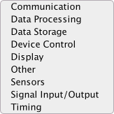

## CLionArduinoPlugin Version Notes

[TOC levels=3,4]: # "Version History"

### Version History
- [TO DO](#to-do)
- [1.4.6](#146)
- [1.4.4](#144)
- [1.4.2](#142)
- [1.4.0](#140)
- [1.3.14](#1314)
- [1.3.12](#1312)
- [1.3.10](#1310)
- [1.3.8](#138)
- [1.3.6](#136)
- [1.3.4](#134)
- [1.3.2](#132)
- [1.3.0](#130)
- [1.2.4](#124)
- [1.2.3](#123)
- [1.2.2](#122)
- [1.2.1](#121)
- [1.2.0](#120)
- [1.1.0](#110)
- [1.0.2](#102)
- [1.0.1](#101)
- [1.0](#10)

#### TO DO

* [ ] Add: `Generate keywords.txt` action to generate keywords.txt based on contained project
      classes and functions.
* [ ] Merge improvements from other forks of [arduino-cmake]:
  * [ ] [Allow setting ARDUINO_SDK_PATH as environment variable]
  * [ ] [Support for ESP32 using Arduino libs]
  * [ ] [Include directories when setting up the library. Added Servo_RECURSE.]

### 1.4.6

* Fix: update to latest libs
* Fix: templates 
  * `#ifdef` to `#ifndef`
  * remove `User_Setup.h`
  * add `README.md` to arduino library template
  * add missing `;` after lib class declaration

### 1.4.4

* Change: refactoring to updated plugin-util
* Fix: `Disconnect on build` project setting was not saved, broken in 1.4.0 
* Add: `On Disconnect Delay`, 50ms default. Introduces a short (0-100ms) delay before a build
  when disconnecting a port to allow the port to become available. On projects with very short
  build times, disconnecting a port does not allow enough time for the port to become available,
  causing the upload to fail with "Resource busy" error. Adding a short delay after disconnect
  solves the problem. On some project it is not needed on others 20ms was sufficient.

### 1.4.2

* Fix: cmake builder to handle dynamic content in command fixed and default arguments.
* Fix: cmake builder to find set project name command in generic set command set.
* Fix: cmake builder to handle any variable to set project name used for project command
* Add: detection when `set(PROJECT_NAME project_name)` is erroneously given as
  `set($\{PROJECT_NAME} project_name)`.
* Fix: `Change build settings` enables show difference and change build buttons when
  generated content differs from current, not just when settings are changed.
* Fix: change build config dialog would use un-sanitized project dir name for project name. If
  the two differed then wrong config would be generated
* Fix: use project name extracted from `CMakeLists.txt` over the directory name of the project
* Fix: serial monitor "edit settings" would always show port name from new project wizard
  instead of project settings while connect/disconnect would use the right port name.
* Fix: exception in displaying serial monitor settings form
* Add: option to log serial port related exceptions to the console
* Fix: change project build settings on error would disable the `Change Build` button and not
  re-enable it when build settings were changed.
* Fix: clean up and refactor code.

### 1.4.0

* Add: UI for changing Arduino build board, cpu, programmer, etc. Under Tools > Arduino Support
  \> Change build settings
* Add: default baud rate in new project wizard to allow using default
* Add: baud rate if one was provided to cmake lists
* Add: basic Arduino CMakeLists.txt builder from template, to have common code for new project
  and change parameters.
* Fix: basic builder properly modifying/inserting commands and generating `CMakeLists.txt`
* Add: using CMakeParser and CMakeBuilder for generating `CMakeLists.txt` for new projects. One
  step away from UI to modify project config.
* Add: template path option and button to copy bundled if path does not exist. Can now customize
  templates used to create projects/sketches
* Fix: templates only accessible as files under debug environment.
* Fix: rework builder to not depend on `set()` variable names and resolve values for command
  matching.
* Fix: refactor builder to use cmake project name variable used in `project()` if it was not
  changed through set/add command, otherwise use one given by mods.
* Add: generic unknown command to handle commands which have no defined type
* Add: generating CMakeLists from config options instead of real files

### 1.3.14

* Add: CMake file parser and formatter, needed for UI to modify existing file. Will also be used
  for generating the `CMakeLists.txt` for new projects and fixing up one that is messed up in
  terms of required order of lines.
* Fix: CMakeFormatter and CMakeParser to handle preserving original file when recreated from
  AST.
* Add: `CMakeListsBuilder` for parsing existing file, modifying values and regenerating the new
  content based on new values but preserving unchanged lines.
* Fix: refactor mess of project wizard gui panel to re-usable form
* Add: trigger re-validation on failure. A hack solution since we are hacking into the IDE
  functionality. It is not exactly open api so kludges are inevitable.
* Fix: minor layout fixes for forms.

### 1.3.12

* Fix: backwards compatibility to 2018.1

### 1.3.10

* Add: `#ifdef/#define/#endif` to library include file
* Fix: arduino library to add additional library path to `CMakeList.txt`
* Fix: change arduino library test file to a sketch from cpp
* Add: `User_Setup.h` to sketch project
* Fix: `#endif` add comment before trailing text
* Fix: exception if new arduino sketch is invoked from non-editor environment
* Add: Serial Monitor tool window with auto disconnect on build/reconnect after build. No hex
  view yet.
* Add: Serial port monitor EOL options, logging sent text and immediate key sending.
* Add: Plugin Config in settings (preferences on OS X) in `Languages & Frameworks > Arduino`
* Add: Settings options for boards.txt and programmers.txt file location, if not give or not
  valid then bundled ones will be used.
* Add: Right click on serial monitor widget to change settings. Click will connect/disconnect.
* Fix: new project default serial monitor settings not saving

### 1.3.8

* Add: skeleton `keywords.txt` and `library.properties` files when creating arduino project.
* Add: options for arduino library project:
  * Add: library test cpp file
  * Add: options for `library.properties`
    * Add: library category dropdown.  
      
    * Add: author name and e-mail
* Fix: language standard missing option if none was previously selected or persisted option was
  empty.

### 1.3.6

* Fix: CPU selection line in `CMakeLists.txt` would be commented out if a new board is selected
  and the CPU was left as default.
* Add: static library changes to `CMakeLists.txt`, using `generate_arduino_library()`
* Fix: if current saved selected board did not have a CPU associated with it then the
  ARDUINO_CPU line in the cmake file would be commented out.

### 1.3.4

* Fix: change plugin name for JetBrains requirements
* Fix: reload CMakeLists.txt after project creation otherwise generated files don't have the
  `-mmcu` set.
* Fix: add port drop down using jssc https://github.com/scream3r/java-simple-serial-connector,
  with `SerialPorts` Patched for Arduino by Cristian Maglie
  https://raw.githubusercontent.com/arduino/Arduino/master/arduino-core/src/processing/app/SerialPortList.java
* Fix: change source packages to match plugin id.
* Fix: make plugin compatible with CLion 2018.1 through 2018.3

### 1.3.2

* Fix: no cpus showing up until board selection is changed
* Fix: add library sub-directory would be set on form opening.

### 1.3.0

* Fix: add project types to `New Project` wizard, only compatible with 2018.3 and above.
* Fix: remove arduino new project action
* Add: arduino library. Adds .cpp and .h file named as project directory,
* Add: boards project option and cpu option (from boards.txt stored in resources). TODO: add
  config for boards.txt path
* Add: programmers (from boards.txt stored in resources). TODO: add config for boards.txt path
* Add: Port option, for now manually set. TODO: add code to scan available ports
* Add: verbose build option
* Add: local library directory option
* Add: icons for sketch file, library and project
* Add: persistence of project creation options, last cpu per board is saved.

### 1.2.4

* Fix: exceptions when run on CLion 2018.
* Add: `CMakeList.txt` reloading on creation (for 2018 or above)
* Add: comments to CMakeList.txt to help startup with non-mega boards
* Fix: change directory layout and plugin.xml to be more compatible with IntelliJ plugins for
  error checking.
* Add: IntelliJ project files to git

### 1.2.3

* Fixed to run on CLion 2016.3.2 and 2017.2.1
* Updating plugin xml to create a branch that can be uploaded to Jetbrains plugin repo.

### 1.2.2

* Fixed .ino and .pde files not refactorable. Increased compatibility for Servo library

### 1.2.1

* Re-compiled for Java 6

### 1.2.0

* Added new project creation to Welcome Screen and File menu

### 1.1.0

* Compatibility with Arduino SDK 1.6 on Mac OS X

### 1.0.2

* Removed Groovy runtime, no longer necessary

### 1.0.1

* Fixed organization

### 1.0

* Convert a project to Arduino CMake. This replaces CMakeLists.txt with a default one, deletes
  the default main.cpp file, copies in the Arduino CMake toolchain files, and deletes the build
  directory to start fresh
* Associates .ino and .pde files as C++ source, so you get syntax highlighting and prediction,
  etc.
* Create a new sketch file in any directory. If you omit the extension, it will add .ino
  automatically
* Adds import for Arduino.h to all newly created sketch files to enable code completion
* Compiled with Java 6 for compatibility with OS X out of the box

[Allow setting ARDUINO_SDK_PATH as environment variable]: https://github.com/Pro/arduino-cmake/commit/2f069184b029dbe5f91dd55e24b854ee79641510
[arduino-cmake]: https://github.com/queezythegreat/arduino-cmake
[Include directories when setting up the library. Added Servo_RECURSE.]: https://github.com/francoiscampbell/arduino-cmake/commit/dbd4fe372b9a0120325b429b3ed23c311ab3dc66
[Support for ESP32 using Arduino libs]: https://github.com/altexdim/arduino-cmake/commit/f21fd1ae0c48583c2b498a24cfa2e65814fff483

